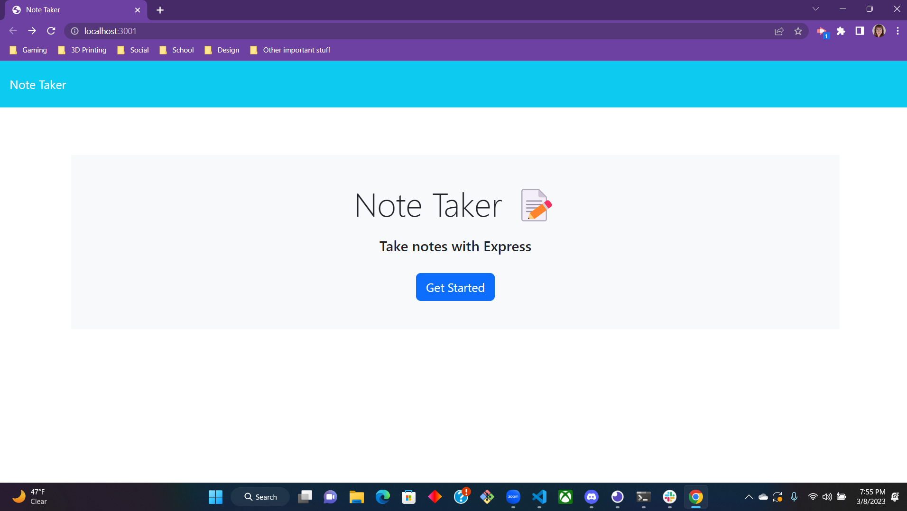
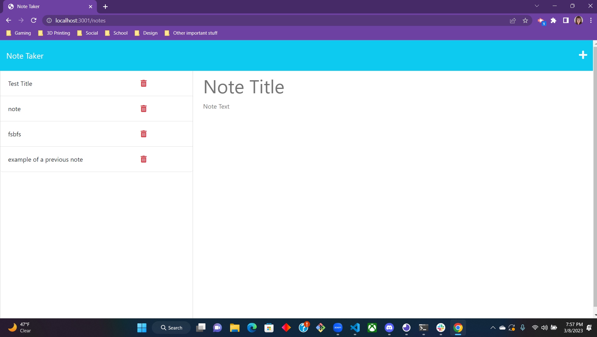

# NoteTaker


## Table of Contents
* [Description](#description)
* [Dependencies](#dependencies)
* [User Story](#user-story)
* [Screenshots](#screenshots)
* [Deployed Project](#deployed-project)
* [Questions](#questions)


## Description

Note Taker is a quick and easy way for the user to organize their thoughts in an organized manner. Great for quick thoughts you dont wanna forget, or even making a list of to-dos.

## Dependencies

Express
UUID

## User Story

```
AS A small business owner
I WANT to be able to write and save notes
SO THAT I can organize my thoughts and keep track of tasks I need to complete
```

## Usage

Currently, in order to view/use. Please use the CLI with the command....

```
node server.js
```
And then follow the localhost link. This project will be deployed via Heroku.

## Screenshots

The following images show the web application's appearance and functionality:





## Deployed Project

This project will be deployed via Heroku. Will have a link soon!

## Questions
Hi, my name is Bri Dray. If you have any questions about my project, please E-mail me [HERE!](mailto:stanggurl02@gmail.com)